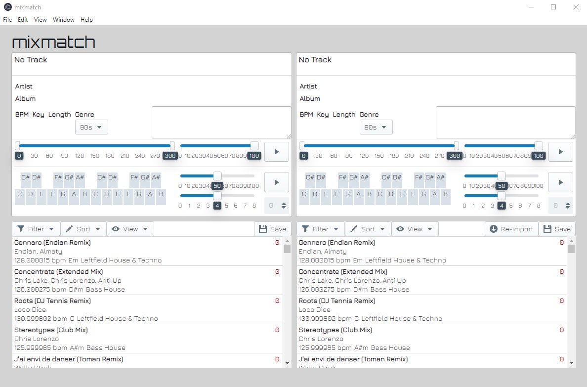

# mixmatch - Manual Key Matcher

As Traktor's analyzer is making some mistakes, there's the need to review each track. This tool can make this process easier.
## Setup and Build
- Clone Repo
- Run "yarn start"
## How it works
- Export playlist of your collection as "all.nml" file (don't copy tracks to new location!).
- Place it in mixmatch root dir.
- Run app and click on "Re-import".
- Select track from the list, wait until it's loaded, then you can play it with the play button.
- You can change the start position with the left slider.
- Change volume with the smaller slider
- You can play a sine tone by left clicking on the keyboard.
- You can set a note on the keyboard by right clicking on it. Then you can play all set notes with the play button.
- Click on save to save the set notes in the database file. (Loading track also saves atm.)

**Check out how often Traktor fails with its analysis!**

This app is in an early state. Re-import also wipes out all set notes and keys!

I will probable not continue the app if no one joins. Working alone is BORING.